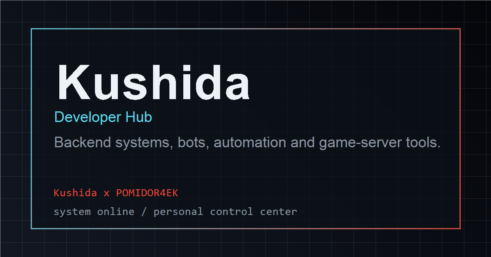
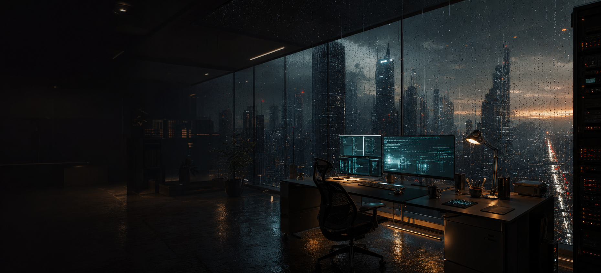

# kushida.tech

## Скрины

## Что внутри

- главный экран с проектами, стеком, контактами и статусами
- блоки GitHub, WakaTime, погоды и активности
- переключение языков
- фоновая дождливая сцена и звук по погоде
- `/ogannes` для курсов, домашки, ответов, заметок и админки
- уведомления и фидбек через Telegram

## Что использовал

- Next.js 16
- React 19
- TypeScript
- Tailwind CSS 4
- Framer Motion
- lucide-react и react-icons
- Node.js server
- Vite + React для Ogannes
- Telegram Bot API
- локальные JSON-файлы для данных Ogannes
